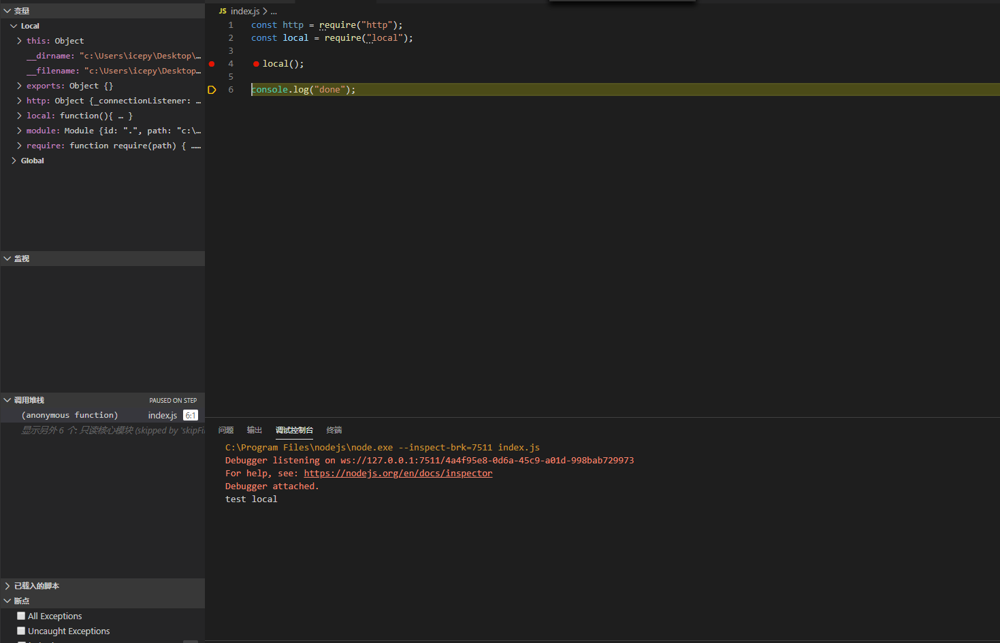
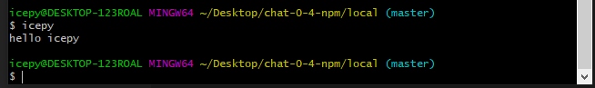
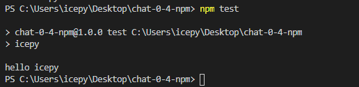
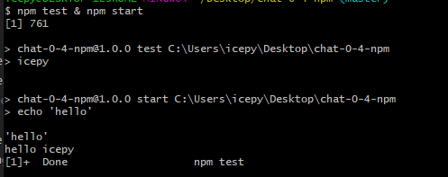
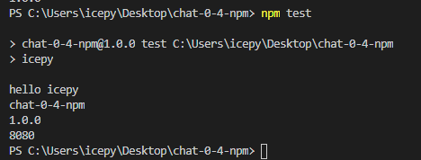
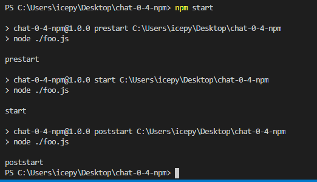
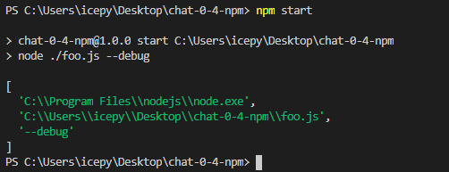
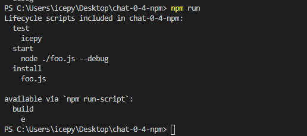

## 为什么要熟悉 NPM 相关的操作

npm 是伴随着 Node.js 成长的包管理器，最初它只服务于后端开发。早期前端相关的童鞋一直在用 bower 来做包管理，再更早的年代前端会用 Ant 来做管理和构建。

> 时间：2020年

对于一门编程语言的开发者而言，包管理（依赖管理）是一项考核该编程语言成熟度的重要标志，在解决多人协作，依赖管理上。

- 一次编写，多次安装复用
- 版本管理也非常方便

目前 NPM 做为事实的标准，不管你用其他任何的构建工具，如：webpack，rollup，parcel 等，或是想安装一个模块，大多数都能在 NPM 这个大仓库中找到，是的，这是中心化的。如果你想给社区贡献你的代码，你可以打包上传到 NPM，提供给开发者使用。

这就是我们为什么需要熟悉 NPM 相关操作的理由。

> 小提示：熟悉之后可以使用 yarn 来替代 npm，使用 nrm 来管理 npm 的源。

## 熟悉 NPM 相关的操作命令

这一部分主要来源于 [https://docs.npmjs.com/cli-documentation/](https://docs.npmjs.com/cli-documentation/)，我挑选了一些我们经常使用的命令，基本涵盖日常开发的 90% 。

> npm init

运行 `npm init -y` 会快速的创建一个 `package.json` 文件。

由于近年来 Cli 工具的流行，npm 提供了一个 `npm init  <@scope> (same as npx <@scope>/create)` 的命令，比如：

```bash
$ npm init react-app ./my-react-app
```

它将由npx安装 `create-react-app` 并启动一个 React 工程。

> npm install & npm uninstall

安装和卸载其实就是一对 `冤家`，它们必然是成对出现的。

常用的方式：

```bash
$ npm i xxx 或 npm r xxx
```

除此之外你还可以用 `tag`，`version` 的形式来安装指定的包。

如：

```bash
$ npm i react@16.8.5
```

在 install 中还有两个便捷的参数非常有用，它们是 `-p` 和 `-d`，分别会保存到 `package.json` 文件中的 `dependencies` 和 `devDependencies` 字段。

有时候我们需要安装内网 git 仓库上的包，可以通过这样的方式：

```bash
$ npm i https://github.com/indexzero/forever/tarball/v0.5.6
```

后缀可以用于控制安装的包版本（也就是 git tag），一共例举了几个方式，如：`gist`，`bitbucket`，`gitlab`，我想对于我们最常用的就是 `gitlab` 了。

```bash
$ npm i gitlab:mygitlabuser/myproject
```

对于开发本地包，可以使用 `file:` 的方式，在包目录创建 `package.json` 如：

```json
{
  "name": "query",
  "main": "index.js",
  "version": "0.1.0"
}
```

然后在应用的目录执行：

```bash
$ npm i file:./query -p
```

我们可以看一下应用层的 `package.json` 文件：

```json
{
  "dependencies": {
    "query": "file:query",
  }
}
```

另外在额外提一嘴 `package-lock.json`，这是后期 npm 参考 yarn.lock 提供的一个机制，用于保证安装包时的依赖可以保持一致（多人协作时）。
 
> npm info

这是 `npm view` 的别名，用于查看一个包的详细属性等信息。

> npm outdated

此命令会列出所有已经过时的包。

> npm update

此命令会更新包

> npm adduser npm publish

一般这两个命令都是成对出现的，`adduser` 是登录 npm 账户，`publish` 是发布当前的包，当然出了发布外，你想安装私有的包，也是需要登录的。

既然说到了 `publish` 额外提一嘴 `.npmignore` 文件，这个文件和 `.gitignore` 文件的作用是相同的，我们可以设想一下，当你对外发布时将不想发布的内容发布了出去，这非常危险，这两个文件就可以控制哪个可以忽略。

> npm start npm stop npm test

这些都是快捷命令，分别执行 `"scripts"` 中的 `start`，`stop`，和 `test`。

> npm help

这个命令也是我们很常用的，npm 的命令非常多和复杂，我们都不一定记得住，不过有 `help` 就帮我们解决这个问题。

```bash
$ npm help adduser
```

> npm dist-tag

当模块非常受欢迎时，对于更新作者一般都会发布 `alpha`，`beta` 等版本，这个时候 `dist-tag` 就非常有了，可以列出所有的 tag，如果你想当尝鲜的小白鼠，你就可以来看看对应最新的 tag（标签）。

> npm bin

这个可以显示 npm 安装的可执行文件的目录地址。

> 小提示

还有一些命令如 `config`，`registry` 等或是 `.npmrc` 文件，这些并不常用，主要是针对 npm 配置相关，我们如果依赖到环境变量或者其他配置时，你就可以使用到这些。

比如我的 `.npmrc` 文件：

```
registry=https://registry.npmjs.org/
sass_binary_site=https://npm.taobao.org/mirrors/node-sass
```

`config` 命令就是用来配合修改配置的。

npm 5.2.0 版本之后会自动安装 `npx`，这个东西会帮你执行依赖包中的二进制文件，如果你经常使用 `create-react-app` 你会发现它很常见：

```
$ npx create-react-app my-app
```

它和 `npm` 之间的关系是有区别的，我们可以理解为 npm 依然是项目管理，而 `npx` 则是在帮我们简化使用命令指令相关的事情。

## 使用 link 在本地开发 JavaScript 包

`link` 命令可以帮助我们模拟包安装后的状态，它会在系统中做一个快捷的映射，这对于测试非常有用。

我们在本地的应用目录中创建一个包叫 `local`，然后输入：

```bash
$ npm link local
```

当你使用 debug 来查看时：



另外如果你开发的是命令行工具，`npm link` 也非常有用，接下来我们对代码做一些改造，创建一个新的文件叫 `icepy.js`：

```js
#! /usr/bin/env node

console.log("hello icepy");
```

接着在 `package.json` 文件的 `bin` 字段中填写如下：

```json
{
  "bin": {
    "icepy": "index.js"
  }
}
```

在命令行目录中 `npm link` 一下，这时我们就可以在终端上看一下结果：



> 小提示

当你修改代码后，不需要再重新 npm link ，因为代码的运行结果会立即生效。

## 详解 NPM Script 各种钩子的运用

我想目前 `npm start` 是社区中使用最多的一个 npm 命令，它可以执行 `package.json` 文件中 `scripts` 配置的脚本：

```json
{
  "scripts": {
    "start": "node ./index.js"
  }
}
```

npm 脚本的原理比较好理解，它会辅助我们新建一个 Shell ，然后在这个 Shell 中执行指定的脚本命令。

> 小提示

这个新建的 Shell 会将当前目录中的 node_modules/.bin 加入到 PATH 中，因此你可以直接使用而无需再用路径的方式，如图：

```json
{
  "scripts": {
    "test": "icepy"
  }
}
```



### 解锁运行 npm scripts 的姿势

一般前端或者 Node.js 项目会包括多个 scripts ，这时对于如何将多个命令同时执行或顺序执行，就有了需求。

串行执行的方式：

```bash
$ npm test && npm start
```

它的执行顺序会严格按照顺序来执行，也就是说在执行完 `npm test` 之后才会执行 `npm start`。

并行执行的方式：

```bash
$ npm test & npm start
```

我们可以看到结果：



> 小提示

这个命令的运行其实和 npm 没有关系，更多用法可以参考一下 shell 环境中的运算符。

如果我们配置的命令有很多，这个时候就需要写很多 `npm run`，那有没有更简约的办法？[https://github.com/mysticatea/npm-run-all](https://github.com/mysticatea/npm-run-all) 这个库可以简化你编写的命令。

### 变量配置

目前有些变量是和 `package.json` 有关的，意思就是说当你执行 `npm run` 命令时，如果你的 `package.json` 文件中配置了如下：

```json
{
  "name": "chat-0-4-npm",
  "version": "1.0.0"
}
```

那么你在执行的 Shell 环境中可以通过 `process.env.npm_package_name` 和 `process.env.npm_package_version` 来获取，其他变量可以以此类推。

但 `package.json` 中有一个特殊的 `config` 对象，你也可以通过它 `process.env.npm_package_config_port` 来获取。



### 生命周期事件

每一次运行的 `run` 它都是有生命周期的，我们可以简单的定义为执行前和执行后，在这个脚本文件我们可以通过 `process.env.npm_lifecycle_event` 来获取当前脚本所处于那个生命周期中（如果你编写的文件分开成了多个文件，那这个变量就没有意义了）。

```json
{
  "start": "node ./index.js",
  "prestart": "node ./index.js",
  "poststart": "node ./index.js"
}
```



它的命令分类比较多，还有包的安装前和安装后，比如：`preinstall` 和 `postinstall`，详细的翻译如下：

- prepublish：在发布之前触发
- prepare：在 prepublish 与 prepublishOnly 之间触发
- prepublishOnly：在 prepare 和 prepack 之间触发，只有运行 npm publish 才会触发这个命令
- prepack: 在打包之前运行，触发条件有：（npm pack npm publish 或是安装一个 git 链接的依赖）
- postpack: 在打包完成之后运行
- publish, postpublish：发布之后运行
- preinstall：安装一个包之前运行
- install, postinstall：安装完成一个包之后运行
- preuninstall, uninstall：卸载一个包之前运行
- postuninstall：卸载一个包完成之后运行
- preversion：更新包的版本之前
- version：更新包的版本之后，但在提交之前
- postversion：更新包的版本之后，并且在提交之后
- pretest, test, posttest：`npm test` 命令的前后
- prestop, stop, poststop：`npm stop` 命令的前后
- prestart, start, poststart：`npm start` 命令的前后
- prerestart, restart, postrestart：`npm restart` 命令的前后，如果没有 `restart` 命令，npm 会默认执行 `stop` 和 `start` 命令
- preshrinkwrap, shrinkwrap, postshrinkwrap：`npm shrinkwarp` 命令前后

### 传递参数

`npm run` 命令是可以传递参数的，我们需要使用 `--` 分隔符，比如：

```json
{
  "scripts": {
    "start": "node ./foo.js --debug"
  }
}
```

在 JS 文件中，我们可以这样获取：

```js
console.log(process.argv[2]);
```

结果：



### 命令自动补全

使用 `npm run` 列出所有的命令，如图：



集成 npm 提供的 [https://docs.npmjs.com/cli/completion](https://docs.npmjs.com/cli/completion) 到你的 zsh 中。

> 小提示

建议大家安装 zsh 和 [oh-my-zsh](https://github.com/ohmyzsh/ohmyzsh)，不解释，你用过就知道。

### 跨平台兼容性处理

首先 windows 用户推荐使用 git bash ，尽量减少其他问题。对于文件系统，我建议大家尽量使用社区提供的跨平台兼容的包，比如删除文件或目录用 [https://www.npmjs.com/package/del-cli](https://www.npmjs.com/package/del-cli) 来代替 `rm -rf`。

其次关于环境变量可以考虑使用 [https://www.npmjs.com/package/cross-var](https://www.npmjs.com/package/cross-var) 来设置，比如将原来：

```json
{
  "scripts": {
    "test": "NODE_ENV=test node ./index.js"
  }
}
```

改为

```json
{
  "scripts": {
    "test": "cross-env NODE_ENV=test node ./index.js"
  }
}
```

> 小提示

如果你的 npm 命令行很多很长，不妨考虑一下将它们迁移到 .sh 脚本中。

```bash
#!/usr/bin/env bash
```

有时间也可以研究一下 shell.js ，比如当你的 npm scripts 越来越复杂时，这不失为一个好的处理方式。最后再提一句，就是我们也可以将跨平台的环境变量依赖，都迁移到一个文件中，然后直接引用不同的文件即可。

## 实战：使用 NPM 完成构建流水线

关于流程，我们做一个简单的设想，使用 webpack 来打包，启用 git hook 在 commit 之前使用 prettier 格式化，然后 eslint 一下给出报告，代码提交后触发 gitlab 的 runner 完成发布（你可以做一个 dev 和 prod 环境），大概分了四个维度：`构建`，`格式化`，`检查`，`CI/CD`，在真实的情况下，构建这一个部分应该让 CI 来做。

首先我们需要安装 `husky` 和 `lint-staged`，这两个包前者可以处理 `git commit` 前置的 hook，后者可以在前者的基础上指定一些配置功能。然后我们需要安装 `eslint` 和 `prettier`，前者可以根据规则对代码进行检查，后者则是可以根据规则对代码进行格式化，这两个包可以配合使用。

创建 `.eslintrc` 配置规则，如下：

```json
{
  "rules": {
    "semi": ["error", "always"],
    "quotes": ["error", "double"]
  },
  "parserOptions": {
    "ecmaVersion": 6
  }
}
```

创建 `.eslintignore` 对于一些文件进行忽略。

接着在 `package.json` 文件中进行配置 git hook 的处理方式：

```json
{
  "scripts": {
    "precommit": "lint-staged"
  },
  "husky": {
    "hooks": {
      "pre-commit": "lint-staged"
    }
  },
  "lint-staged": {
    "./src/**/*.js": "eslint"
  }
}
```

## 思考

做为一个商业化中心化的平台，近年来关于安全方面的事故，发生了多起。这源于 JavaScript 生态的丰富，NPM 的注册机制并没有任何审核等。

想想著名的 `left-pad` 事件，导致很多不能用，当然后面 NPM 的做法是收回了删除的权限。还有一些是直接在代码中注入另外的脚本代码，我们可以将它看做木马，这个事情多数在和钱包相关的领域中被发现。

整体来看，在我们依赖开源项目的今天，安全这个事情，很值得我们去思考，我们该用什么机制，来至少保证依赖的安全性？

